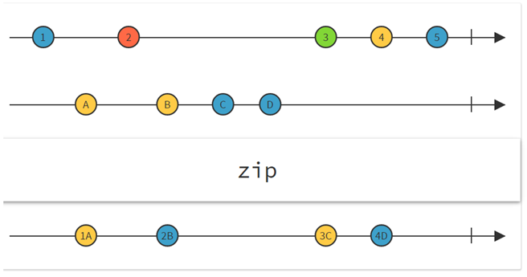

# UniRx Study
## More operators!

`ThrottleFirst(TimeSpan dueTime)` 메시지가 집중되었을 시 첫 메시지만 발행한다. **첫 메시지부터 인자로 준 시간까지**를 집중된 시점으로 본다.

`ThrottleFrame/ThrottleFirstFrame` 프레임의 마지막/첫 메시지만 발행한다.

`Delay(TimeSpan dueTime)` 메시지 발행을 연기한다.

`Repeat` 스트림이 종료될 때 (OnCompleted 호출) 다시 한번 `Subscribe` 한다.

`Zip(IObservable<TRight> right)` 현재 스트림과 인자로 준 스트림의 메시지가 모두 갖춰질 때까지 기다렸다가 갖춰지면 메시지 발행.



```cs

public Button btn1;
public Button btn2;
public IObservable<Unit> btn1Observable;
public IObservable<Unit> btn2Observable;

// Start is called before the first frame update
void Start()
{
	btn1Observable = btn1.OnClickAsObservable();

	btn1Observable.Zip(btn2.OnClickAsObservable(), (b1, b2) => "Clicked")
	.First()
	.Repeat()
	.Subscribe(message => Debug.Log(message));
}
```
Zip 사용 예시이다. 버튼 두개를 순차적으로 클릭했을 시 "Clicked"를 출력한다.

일단 두 버튼의 입력에 대한 스트림을 합치고(Zip), 두 스트림의 메시지가 모두 발행되었을 시 두 스트림 각각의 첫번째 메시지만 받은 후(First) 재구독(Repeat)해 스트림의 메시지를 초기화한다.

---
